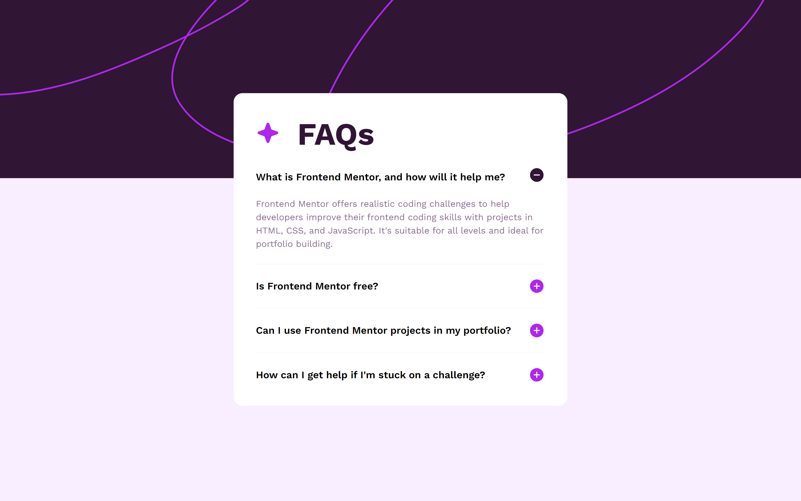

# Frontend Mentor - FAQ accordion solution

This is a solution to the [FAQ accordion challenge on Frontend Mentor](https://www.frontendmentor.io/challenges/faq-accordion-wyfFdeBwBz). Frontend Mentor challenges help you improve your coding skills by building realistic projects.

## Table of contents

-   [Overview](#overview)
    -   [The challenge](#the-challenge)
    -   [Screenshot](#screenshot)
    -   [Links](#links)
-   [My process](#my-process)
    -   [Built with](#built-with)
    -   [What I learned](#what-i-learned)

## Overview

### The challenge

Users should be able to:

-   Hide/Show the answer to a question when the question is clicked
-   Navigate the questions and hide/show answers using keyboard navigation alone
-   View the optimal layout for the interface depending on their device's screen size
-   See hover and focus states for all interactive elements on the page

### Screenshot

### Links

-   Solution URL: https://github.com/Choconaldo/FAQ-accordion
-   Live Site URL: https://choconaldo.github.io/FAQ-accordion/

## My process

### Built with

-   Semantic HTML5 markup
-   CSS custom properties
-   Flexbox
-   Mobile-first workflow
-   Vanilla JavasSript

### What I learned

I've learned a little more about accessibility by using semantic HTML and its intrinsic attributes, like using button tags to make keyboard only navigation possible.

I also learned how to make my code dryer using loops to add event listeners.
